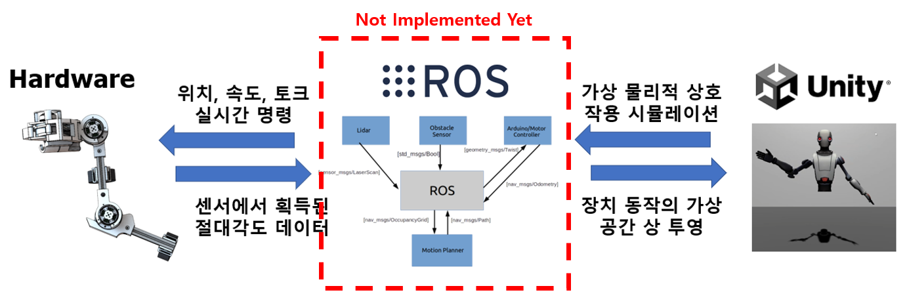

# **웨어러블 외골격 장치**를 활용한 **햅틱 상호작용** 구현

Created : 2022. 12. 21  
Revised : Not yet

---
## Table of Contents  
1.  리포지토리 구성
2.  소프트웨어 연계 구성
3.  수행 결과  
---
## 1. 리포지토리 구성  
>### src/
>프로젝트의 소프트웨어 소스코드 및 하드웨어 결과물  
>>### src/hardware  
>>하드웨어 설계 사진 및 도면 수록
>
>>### src/embedded
>>[*Raspberry Pi Pico*](https://www.raspberrypi.com/documentation/microcontrollers/raspberry-pi-pico.html) MCU에 탑재되는 제어 임베디드 펌웨어 소스코드 수록
>
>>### src/unity
>>장치와 연계 동작하는 시연용 유니티 프로젝트 소스코드 수록  
>>
>  

>### image/, video/
> markdown 첨부용 이미지 및 시연 동영상  
---  
## 2. 소프트웨어 연계 구성  

1. Raspberry Pi Pico에 embedded 펌웨어 탑재

2. Unity 시연용 Instance와 Raspberry Pi Pico 간 Serial Communication 수행

3. Unity 시연용 Instance에서 Serial Communication으로 받아온 각도 데이터 반영  
  &nbsp;  

---  
## 3. 수행 결과  

